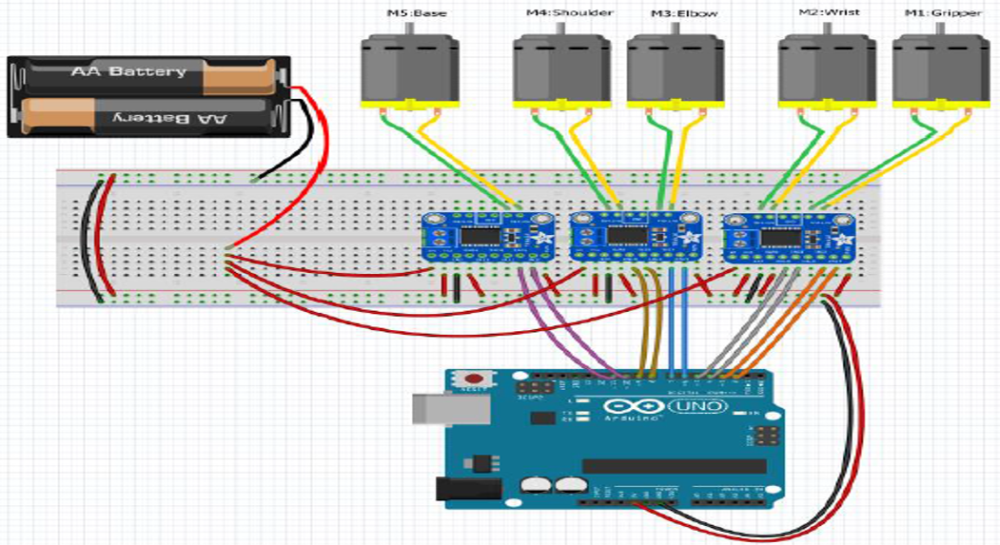

# RobotArm
This repository contains code for the Android app and Arduino used to control the robot arm. This was a lab project for Advanced Object-Oriented Programming, created by Alex Perr and Zach Snyder 

## Hardware setup

## Files
- AndroidApp
- Arduino 
