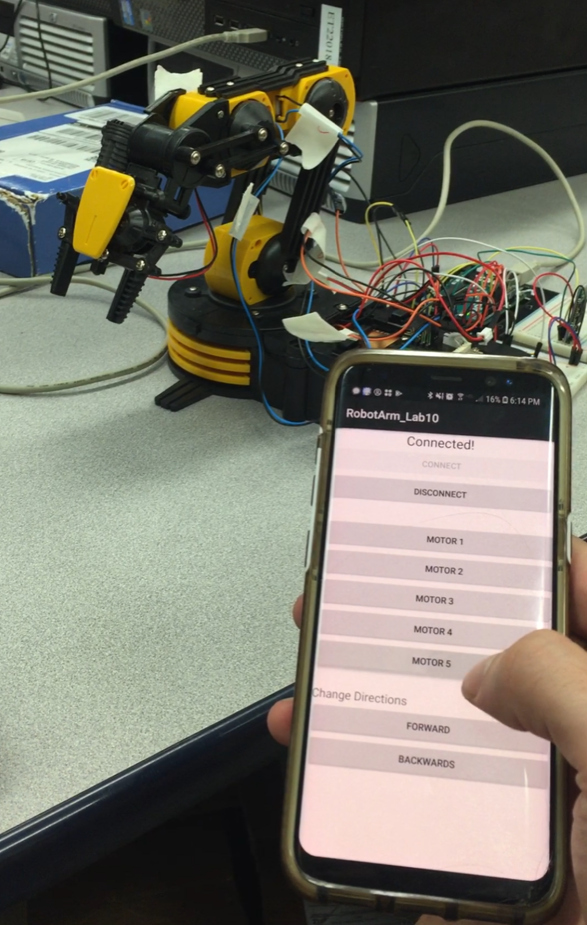

video {
  width: 100%;
  height: auto;
}

# RobotArm
This repository contains code for the Android app and Arduino used to control the robot arm. This was a lab project for Advanced Object-Oriented Programming, created by Alex Perr and Zach Snyder 

## Hardware setup

<video width="400" controls>
      <source src="mov_bbb.mp4" type="video/mp4">
      <source src="mov_bbb.ogg" type="video/ogg">
      Your browser does not support HTML5 video.
    </video>

## Files
- AndroidApp
- Arduino 
